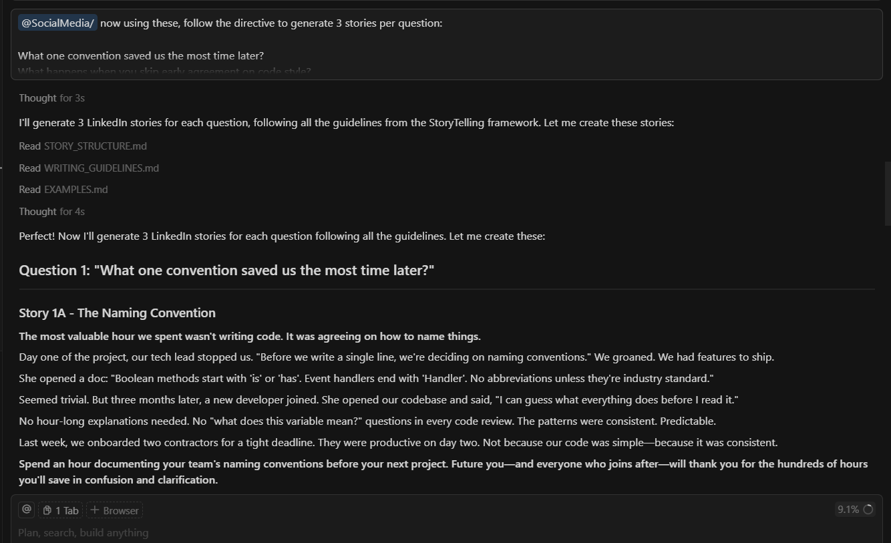

# Context Engineering

Welcome to **Context Engineering**, a comprehensive toolkit for crafting effective AI prompts and content generation strategies. This tool helps developers, content creators, and AI practitioners transform technical questions into engaging, emotionally-resonant narratives optimized for social media platforms.

## What You'll Find Here

Context Engineering provides practical frameworks and templates for:

- **AI Prompt Engineering**: Structured approaches to creating effective prompts for AI models
- **Story Generation**: Transform technical concepts into compelling narratives
- **Social Media Optimization**: Platform-specific content guidelines and formatting
- **Content Templates**: Ready-to-use templates for various content types

## Key Features

### **StoryTelling Framework**
- Complete guide for transforming technical questions into LinkedIn stories
- 3-part story structure (Value → Story → Call to Action)
- "Show, don't tell" techniques with concrete examples
- Emotional connection strategies for maximum engagement

### **Multi-Platform Support**
- LinkedIn (default) - Professional storytelling
- Twitter/X - Concise, punchy content
- Instagram - Visual, emotional narratives
- Facebook - Conversational, community-focused content

### **AI Integration Ready**
- Complete prompt templates for AI story generation
- Quality checklists and validation criteria
- Platform-specific adaptation guidelines
- Testing and troubleshooting guides

### **Educational Resources**
- Writing guidelines with before/after examples
- Common pitfalls and how to avoid them
- Character creation and scene-setting techniques
- Voice and tone optimization

## Available Modules

### [StoryTelling](./SocialMedia/StoryTelling/)

A comprehensive framework for creating engaging LinkedIn stories from technical questions. Features include story structure templates, writing guidelines, platform specifications, and ready-to-use AI prompt templates.

**Perfect for:**
- Technical content creators
- AI prompt engineers
- Social media managers
- Developer advocates

### [Documentation](./Documentation/)
Additional documentation and visual guides for implementing context engineering principles in your projects.

## Quick Start

1. **Choose Your Platform**: Start with LinkedIn (default) or adapt for your target platform
2. **Read the Framework**: Review `StoryTelling/README.md` for the complete methodology
3. **Study Examples**: Examine `StoryTelling/EXAMPLES.md` for proven story structures
4. **Use the Templates**: Apply `StoryTelling/AI_PROMPT_TEMPLATE.md` for AI generation
5. **Customize**: Adapt the guidelines for your specific use case and audience

## Story Generation Process

### 1. Input
Any technical or conceptual question, such as:
- "What's the first step to finding real-world DDD concepts?"
- "How do we avoid overcomplicating early domain models?"
- "What one convention saved us the most time later?"

### 2. Framework Application
Follow the 3-part structure:
- **Main Value** (20-30 words): Bold, clear opening statement
- **Story Body** (120-140 words): Specific scene with emotional connection
- **Call to Action** (30-40 words): Actionable advice or reflection question

### 3. Output
LinkedIn-ready story (≤200 words) that:
- Shows rather than tells
- Creates emotional resonance
- Provides actionable value
- Engages the target audience

## Example Output

**Question**: "What one convention saved us the most time later?"

**Generated Story**:
> The most valuable hour we spent wasn't writing code. It was agreeing on how to name things.
> 
> Day one of the project, our tech lead stopped us. "Before we write a single line, we're deciding on naming conventions." We groaned. We had features to ship.
> 
> She opened a doc: "Boolean methods start with 'is' or 'has'. Event handlers end with 'Handler'. No abbreviations unless they're industry standard."
> 
> Seemed trivial. But three months later, a new developer joined. She opened our codebase and said, "I can guess what everything does before I read it."
> 
> No hour-long explanations needed. No "what does this variable mean?" questions in every code review. The patterns were consistent. Predictable.
> 
> **Spend an hour documenting your team's naming conventions before your next project. Future you—and everyone who joins after—will thank you for the hundreds of hours you'll save in confusion and clarification.**

## Use Cases

### For Developers
- Transform technical blog posts into engaging social media content
- Create compelling developer advocacy content
- Generate educational stories from code experiences

### For Content Teams
- Scale content creation with AI-assisted story generation
- Maintain consistent voice and quality across platforms
- Optimize content for specific social media algorithms

### For AI Practitioners
- Study effective prompt engineering techniques
- Learn content generation best practices
- Implement structured AI workflows

## Getting Started

1. **Browse the Modules** - Each module has detailed documentation and examples
2. **Check the License** - Review the LICENSE file for usage terms
3. **Follow the Setup Instructions** - Start with the StoryTelling framework
4. **Experiment and Learn** - Modify templates to understand the principles
5. **Build Your Content** - Use these tools as building blocks for your content strategy

## Contributing

We welcome contributions! If you have ideas for new frameworks or improvements:

1. Fork this repository
2. Create your enhancement or new module
3. Add clear documentation and examples
4. Submit a pull request

## License

This project is licensed under the Mozilla Public License Version 2.0. See the [LICENSE](./LICENSE) file for details.

---

**Context Engineering** is part of the Chanchito App Tools collection, committed to making AI content creation accessible and effective for everyone. We believe that by sharing these frameworks and techniques, we can help the developer community create more engaging, valuable content that connects with audiences on a human level.
