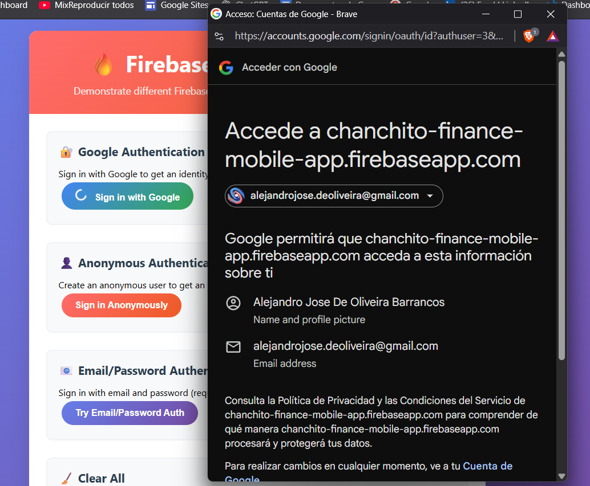

# Chanchito App Tools

Welcome to **Chanchito App's** collection of public Tools!

We're passionate about making development easier and more accessible for everyone. Our Tools are designed to help developers learn, experiment, and build amazing applications with modern technologies.

## What You'll Find Here

This repository contains practical, real-world examples that demonstrate various technologies, patterns, and best practices. Each Tool is:

- **Well-documented** with clear setup instructions
- **Production-ready** code that you can use as a starting point
- **Educational** with explanations of key concepts
- **Open source** and free to use in your projects

## Available Tools

### [Firebase Web Client](./firebase-web-client/)

A lightweight, client-side only web application demonstrating Firebase authentication methods and identity token retrieval.

## Getting Started

1. **Browse the Tool** - Each POC has its own directory with detailed documentation
2. **Clone or download** the specific POC you're interested in
3. **Follow the setup instructions** in each POC's README
4. **Experiment and learn** - Modify the code to understand how it works
5. **Build something amazing** - Use these tools as building blocks for your projects

## Contributing

We welcome contributions! If you have ideas for new tools or improvements to existing ones:

1. Fork this repository
2. Create your tool or improvement
3. Add clear documentation
4. Submit a pull request

## About Chanchito App

Chanchito App is committed to making financial technology accessible and easy to understand. We believe that by sharing our knowledge and tools, we can help the developer community grow and create better applications.

**Happy Coding!**