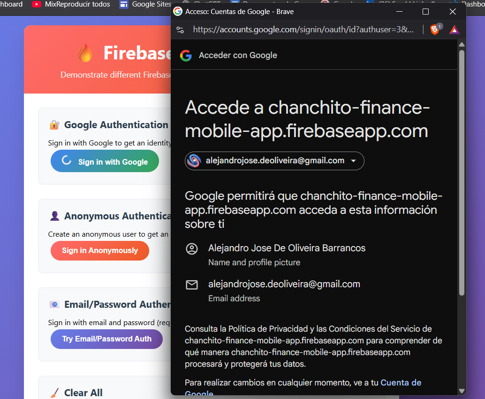
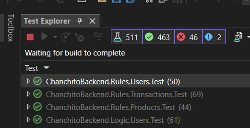
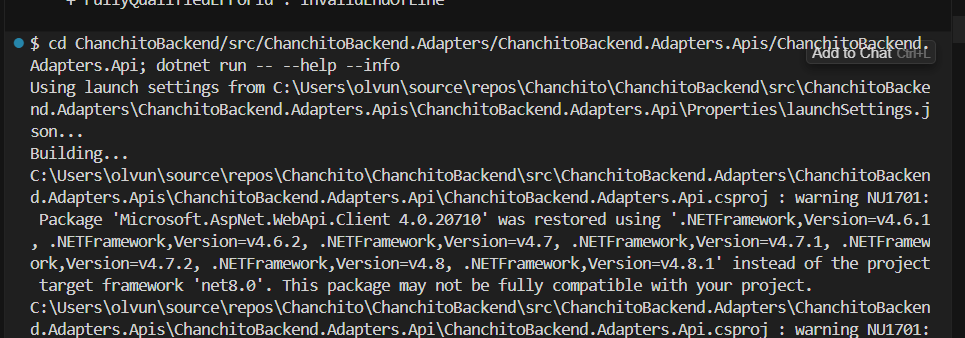
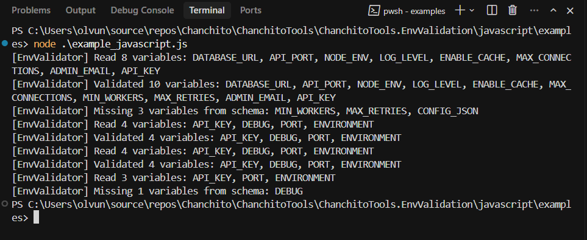

# Chanchito App Tools

Welcome to **Chanchito App's** collection of public Tools!

We're passionate about making development easier and more accessible for everyone. Our Tools are designed to help developers learn, experiment, and build amazing applications with modern technologies.

## What You'll Find Here

This repository contains practical, real-world examples that demonstrate various technologies, patterns, and best practices. Each Tool is:

- **Well-documented** with clear setup instructions
- **Production-ready** code that you can use as a starting point
- **Educational** with explanations of key concepts
- **Open source** and free to use in your projects (each tool has its own license)

## Available Tools

Each tool in this repository has its own license. Please check the LICENSE file in each tool's directory for specific licensing terms.

### [Firebase Web Client](./ChanchitoTools.FirebaseWebClient/)

A lightweight, client-side only web application demonstrating Firebase authentication methods and identity token retrieval.

### [Testing Abstractions](./ChanchitoTools.TestingAbstractions/)

  
A comprehensive .NET testing library that provides robust testing utilities, abstractions, and helpers to streamline your testing workflow. Features include test data builders, custom assertions, database testing support, and integration testing infrastructure.

### [Command Management](./ChanchitoTools.CommandManagement/)

  
A simple, reusable command management system for .NET applications with dependency injection support. Features include multiple command execution, command groups, built-in logging, environment safety checks, and seamless integration with ASP.NET Core applications.

### [Context Engineering](./ChanchitoTools.ContextEngineering/)

A comprehensive toolkit for crafting effective AI prompts and content generation strategies. Transform technical questions into engaging, emotionally-resonant narratives optimized for social media platforms, featuring storytelling frameworks, multi-platform support, and ready-to-use AI prompt templates.

### [Env Validation](./ChanchitoTools.EnvValidation/)

A portable environment variable validation library with a core Lua implementation and adapters for Python and JavaScript. Define schemas in JSON for complete language portability, with support for multiple data types, advanced validations (enum, min/max, patterns), default values, and clear error messages. The same schema file works across all supported languages, ensuring consistent validation throughout your stack. Includes adapters using `lupa` (Python) and `fengari` (JavaScript) to execute the core Lua validation logic.

### [Google Pay](./ChanchitoTools.GooglePay/)

A reusable Google Pay integration module for web applications. Features a complete book store demo with Google Pay checkout functionality. The Google Pay logic is modular and can be easily copied and pasted into any other app for quick integration. See [ChanchitoTools.GooglePay/README.md](./ChanchitoTools.GooglePay/README.md) for detailed setup and usage instructions.

## Getting Started

1. **Browse the Tools** - Each tool has its own directory with detailed documentation
2. **Check the License** - Review the LICENSE file in each tool's directory for usage terms
3. **Clone or download** the specific tool you're interested in
4. **Follow the setup instructions** in each tool's README
5. **Experiment and learn** - Modify the code to understand how it works
6. **Build something amazing** - Use these tools as building blocks for your projects

## Contributing

We welcome contributions! If you have ideas for new tools or improvements to existing ones:

1. Fork this repository
2. Create your tool or improvement
3. Add clear documentation and appropriate LICENSE file
4. Submit a pull request

Chanchito App is committed to making financial technology accessible and easy to understand. We believe that by sharing our knowledge and tools, we can help the developer community grow and create better applications.
