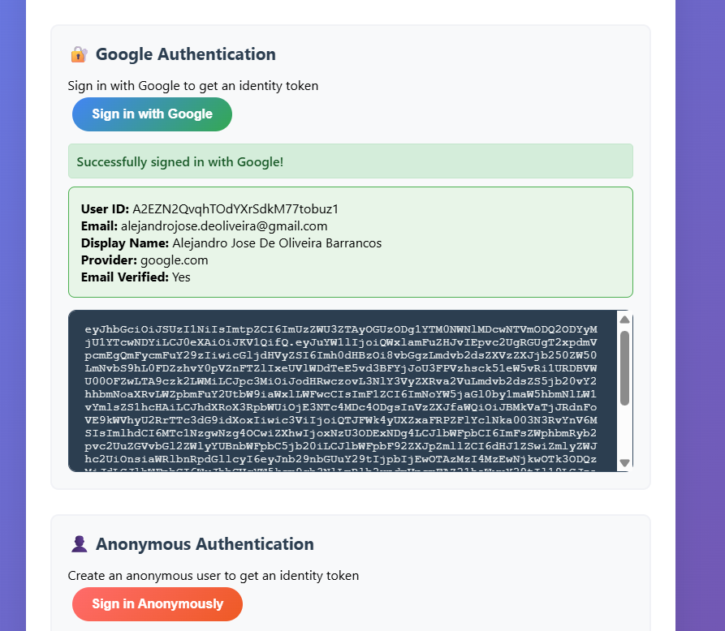

# Firebase Web Client POC

A lightweight **client-side only** web application demonstrating Firebase authentication methods and identity token retrieval.

## Features




- **Google Authentication** - Sign in with Google and get ID tokens
- **Anonymous Authentication** - Create anonymous users and get ID tokens  
- **Email/Password Authentication** - Sign in with email/password (requires pre-created users)
- **Modern UI** - Clean, responsive interface for displaying tokens
- **No Server Required** - Pure client-side solution using Firebase SDK

## Prerequisites

- A web browser (Chrome, Firefox, Safari, Edge)
- Firebase project with Authentication enabled
- Python (for local development server) or any web server

## Setup Instructions

### 1. Configure Firebase

1. Go to your Firebase Console (https://console.firebase.google.com/)
2. Select your project: `chanchito-finance-mobile-app`
3. Go to Project Settings > General
4. Scroll down to "Your apps" and add a web app if you haven't already
5. Copy the Firebase configuration object

### 2. Update Firebase Configuration

Create a `firebase-config.json` file with your Firebase configuration:

```json
{
  "apiKey": "your-actual-api-key",
  "authDomain": "chanchito-finance-mobile-app.firebaseapp.com",
  "projectId": "chanchito-finance-mobile-app",
  "storageBucket": "chanchito-finance-mobile-app.appspot.com",
  "messagingSenderId": "your-actual-sender-id",
  "appId": "your-actual-app-id",
  "measurementId": "your-measurement-id"
}
```

The client will automatically load this configuration at startup.

### 3. Enable Authentication Methods

**IMPORTANT**: You must enable the authentication methods in Firebase Console before using the app.

In Firebase Console:
1. Go to [Firebase Console](https://console.firebase.google.com/)
2. Select your project
3. Go to **Authentication** > **Sign-in method**
4. Enable the following providers:
   - **Google** - Click "Google" and toggle "Enable"
   - **Anonymous** - Click "Anonymous" and toggle "Enable"
   - **Email/Password** (optional) - Click "Email/Password" and toggle "Enable"

**Note**: If you don't enable these methods, you'll see specific error messages in the app telling you which methods need to be enabled.

### 4. Start the Application

**Option 1: Using Python (recommended)**
```bash
cd firebase-web-client
python -m http.server 8000
```

**Option 2: Using Node.js http-server**
```bash
npx http-server -p 8000
```

**Option 3: Using any web server**
Just serve the files from the `firebase-web-client` directory

The application will be available at `http://localhost:8000`

## Authentication Methods Demonstrated

### 1. Google Authentication
- Uses Firebase Auth with Google provider
- Displays user information and ID token
- Token can be used for authenticated API calls

### 2. Anonymous Authentication
- Creates temporary anonymous users
- Useful for guest experiences
- Users can be converted to permanent accounts later

### 3. Email/Password Authentication
- Uses Firebase Auth with email/password provider
- Requires users to be pre-created in Firebase Console
- Demonstrates client-side authentication flow

## Security Notes

- ID tokens are safe to use client-side for API authentication
- No server-side secrets or credentials required
- All authentication handled by Firebase client SDK

## Troubleshooting

### Common Issues

1. **"Firebase App not initialized"**
   - Check that Firebase configuration is correct
   - Ensure all required fields are filled

2. **"Google sign-in popup blocked"**
   - Allow popups for localhost
   - Check browser popup blocker settings

3. **"Invalid API key"**
   - Verify API key in Firebase Console
   - Ensure the key is for the correct project

4. **"CORS errors"**
   - Make sure you're serving the files through a web server (not file://)
   - Use `python -m http.server 8000` or similar

5. **"Anonymous authentication is not enabled"**
   - Go to Firebase Console > Authentication > Sign-in method
   - Click on "Anonymous" and toggle "Enable"
   - Save the changes

6. **"Google authentication is not enabled"**
   - Go to Firebase Console > Authentication > Sign-in method
   - Click on "Google" and toggle "Enable"
   - Configure the OAuth consent screen if prompted

### Debug Mode

Enable debug logging by opening browser console. All authentication events and errors will be logged there.

## Project Structure

```
firebase-web-client/
├── index.html              # Main UI
├── client.js               # Client-side Firebase auth
├── server.js               # Lightweight Express server
├── package.json            # Dependencies
├── firebase-config.json    # Firebase configuration (excluded from git)
├── firebase-config.example.js  # Configuration example
└── README.md               # This file
```

## Next Steps

- Add more authentication providers (Facebook, Twitter, etc.)
- Implement token refresh logic
- Add user management features
- Deploy to static hosting (Netlify, Vercel, GitHub Pages)
